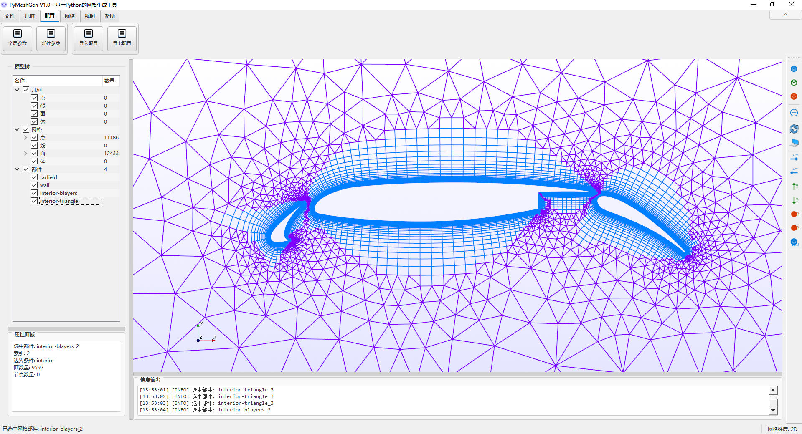

# PyMeshGen [](./LICENSE.txt)

[中文说明](./README_zh.md) · [Packaging Guide](./README_PACKAGING.md)



PyMeshGen is an open-source Python project for unstructured mesh generation aimed at CFD/FEA preprocessing and algorithm research. The actively maintained runtime focuses on 2D workflows built around Fluent `.cas` boundary input, quadtree sizing, boundary-layer growth, advancing-front meshing, and a Delaunay pipeline with Bowyer-Watson and Triangle backends.

## Highlights

- Fluent `.cas`-driven boundary import for meshing workflows
- VTK and STL import/export support
- PyQt5 GUI and command-line entry points
- Boundary-layer generation plus interior triangular and hybrid tri/quad meshing
- Quadtree-based sizing field and post-meshing optimization
- Experimental neural-network and reinforcement-learning smoothing modules under `neural/`

## Requirements

- Python 3.8+
- Install runtime dependencies with:

```bash
pip install -r requirements.txt
```

Some optional workflows, especially GUI and geometry import/export, rely on heavyweight packages such as VTK, PyQt5, and `pythonocc-core`.

## Installation

### PyPI (preferred after publication)

```bash
pip install pymeshgen
```

Available entry points after installation:

```bash
pymeshgen --case ".\config\30p30n.json"
pymeshgen-gui
```

### Local development

```bash
pip install -e .
```

## Quick start

### Command line

```bash
python PyMeshGen.py --case ".\config\30p30n.json"
```

If `--case` is omitted, `Parameters` falls back to `config\main.json`, which points to the active case JSON.

### GUI

```bash
python start_gui.py
```

The GUI bootstraps project paths automatically and also adds `3rd_party\meshio\src` to `sys.path` for bundled meshio compatibility.

### Library usage

```python
from data_structure.parameters import Parameters
from PyMeshGen import PyMeshGen

params = Parameters("FROM_CASE_JSON", r".\config\30p30n.json")
mesh = PyMeshGen(params)
```

## Configuration model

Case JSON files live under `config/` and typically define:

- `input_file` / `output_file`
- `mesh_type`
- `delaunay_backend`
- `triangle_point_strategy`
- global sizing / visualization options
- `parts`, where each part must provide at least `part_name`

Common part-level options include `max_size`, `PRISM_SWITCH`, `first_height`, `growth_rate`, `max_layers`, `full_layers`, and `multi_direction`.

## Meshing pipelines

| `mesh_type` | Pipeline |
| --- | --- |
| `1`, `2` | Triangular mesh generation through the advancing-front pipeline |
| `3` | Hybrid tri/quad generation; `triangle_to_quad_method == "q_morph"` uses a triangle-first path |
| `4` | Delaunay triangulation through `delaunay.create_bowyer_watson_mesh()` |

Notes for `mesh_type == 4`:

- `delaunay_backend` defaults to `bowyer_watson`
- `triangle_point_strategy` defaults to `equilateral`
- when boundary layers are enabled, the effective interior backend is forced to `triangle` to improve robustness near layered fronts

## Project structure

| Path | Responsibility |
| --- | --- |
| `PyMeshGen.py` | CLI entry and lightweight library wrapper |
| `start_gui.py` | GUI launcher |
| `core.py` | Main orchestration pipeline |
| `data_structure/` | Parameters, fronts, cells, and `Unstructured_Grid` |
| `meshsize/` | Quadtree sizing-field construction |
| `adfront2/` | Boundary-layer and advancing-front interior generation |
| `delaunay/` | Bowyer-Watson core, Triangle backend, validation, and postprocess helpers |
| `fileIO/` | CAS/VTK/STL/OCC input-output utilities |
| `gui/` | PyQt5 GUI modules |
| `optimize/` | Mesh optimization and smoothing |
| `unittests/` | Regression and unit tests |

## Testing

Run the existing repository test entry points:

```bash
cd unittests
python run_tests.py
python run_quick_tests.py
```

Run a focused unittest target from the repository root when working on Delaunay or boundary-layer logic:

```bash
python -m unittest unittests.test_bowyer_watson.TestBowyerWatsonJSONConfig.test_anw_bowyer_watson
```

## Documentation

- Chinese overview: [`README_zh.md`](./README_zh.md)
- Packaging and release workflow: [`README_PACKAGING.md`](./README_PACKAGING.md)
- Delaunay design notes: [`docs/design/Delaunay模块详细设计.md`](./docs/design/Delaunay模块详细设计.md)
- GUI design notes: [`docs/design/README_GUI module.md`](./docs/design/README_GUI%20module.md)
- Model tree notes: [`docs/design/README_model tree.md`](./docs/design/README_model%20tree.md)

## Packaging

PyMeshGen now prioritizes **Python package distribution through PyPI**.

For standard Python source and wheel builds:

```bash
python -m pip install build
python -m build
```

For PyPI publishing and release workflow details, see [`README_PACKAGING.md`](./README_PACKAGING.md). Windows executable packaging remains available as an optional secondary path.

## License

PyMeshGen is distributed under GPLv2+. See [`LICENSE.txt`](./LICENSE.txt).

## Contact

- **Project initiator**: cfd_dev <cfd_dev@126.com>
