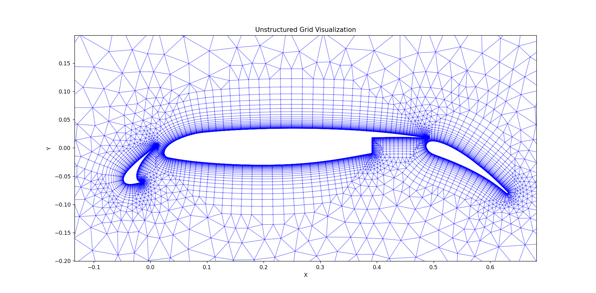

# PyMeshGen [](https://www.gnu.org/licenses/old-licenses/gpl-2.0.html)



## 项目概述
开源的python非结构网格生成工具，专注于为计算流体力学或有限元分析(CFD/FEA)提供易用的二维网格生成解决方案，同时集成了多种主流网格生成算法供研究学习。

## 项目发起人：
- cfd_dev，cfd_dev@126.com
  
## 主要特性
- **输入输出**
  - 支持导入Fluent `.cas` 网格格式
  - 导入导出VTK `.vtk` 可视化格式
  - 导入导出`.stl`网格格式
- **核心算法**
  - 二维阵面推进法（Advancing Front）
  - 边界层推进技术（Advancing Layer）
  - 四叉树背景网格尺寸控制
- **网格类型**
  - 三角形各向同性网格
  - 四边形边界层网格
- **高级网格优化方法**
  - 基于人工神经网络的网格光滑(NN-Smoothing)
  - 基于深度强化学习的网格光滑(DRL-Smoothing)
  - 基于Adam优化器的网格质量优化(Adam-Smoothing)

## 快速开始
```bash
# 安装依赖
pip install -r requirements.txt

# 生成示例网格
python PyMeshGen.py --case "./config/30p30n.json"

# 启动GUI界面
python start_gui.py
```

## GUI使用说明
GUI提供了直观的图形界面，网格生成工作流程如下：
1. **导入CAS网格**：通过文件标签导入Fluent `.cas`文件
2. **提取边界**：使用几何标签提取边界网格和部件信息
3. **配置参数**：在配置标签中设置全局和部件特定的网格参数
4. **生成网格**：使用网格标签的生成按钮创建网格
5. **导出网格**：将生成的网格保存为各种格式

Ribbon界面包含6个标签页：
- **文件**：工程管理和文件操作
- **几何**：网格导入和边界提取
- **视图**：相机控制和渲染选项
- **配置**：全局和部件参数设置
- **网格**：网格生成和优化操作
- **帮助**：文档和支持

详细GUI使用说明请参考 `gui/README.md`。

## 开发团队
- **项目发起人**: cfd_dev <cfd_dev@126.com>