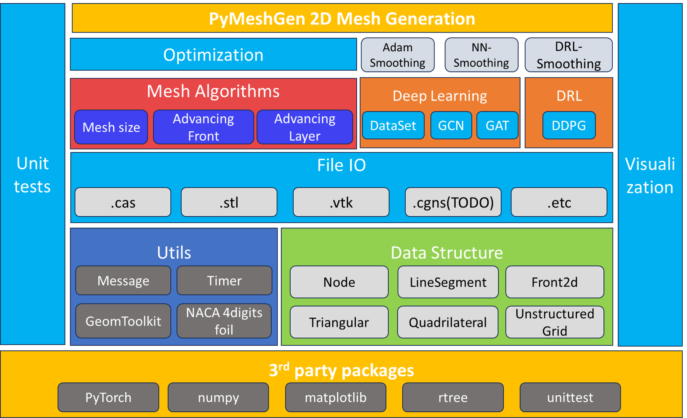

# PyMeshGen User Guide v0.1.0

## Table of Contents
- Chapter 1: Introduction
- Chapter 2: Getting Started
- Chapter 3: Framework and Core Modules
- Chapter 4: Mesh Generation Algorithms
- Chapter 5: Mesh Post-Processing
- Chapter 6: Advanced Features
- Chapter 7: Examples
- Chapter 8: Troubleshooting

## Chapter 1: Introduction
PyMeshGen is an open-source Python-based unstructured Mesh Generator(PyMeshGen) for CFD/FEA (Computational Fluid Dynamics/ Finite Element Analysis), providing basic 2D mesh generation tools, study platform of widely used meshing algorithms and AI-driven mesh generation.
The three main features of PyMeshGen are illustrated as follows:
1. Basic 2D mesh generation tools: 
   - CAD file import
   - 1D curve meshes (TODO)
   - 2D Isotropic Triangular/Quadrilateral Meshes
   - 2D Anisotropic Quadrilateral Boundary Layers
   - CAE Mesh file export
2. Study platform of widely used algorithms: 
   - curve meshing method (TODO)
   - advancing front method
   - boundary layer advancing technique
   - quadtree background mesh sizing
   - mesh optimization algorithms
3. Study platform for AI-driven Mesh Generation
   - Mesh Sampling and Dataset Construction
   - Neural Network-Based Mesh Smoothing(NN-Smoothing)
   - Deep Reinforcement Learning-Based Mesh Smoothing(DRL-Smoothing)
   - Mesh Optimization with Adam Optimizer(Adam-Smoothing)
  
This guide will walk you through the installation, usage, and advanced features of PyMeshGen.

## Chapter 2: Getting Started
To get started with PyMeshGen, you need:
1. Download/clone the source code from the following repository:
     - https://github.com/cfd-dev/PyMeshGen
2. Install requirements
```bash
# Install dependencies
pip install -r requirements.txt
```
3. Run the main script 
```bash
# Generate sample mesh
python PyMeshGen.py --case "./config/30p30n.json"
```
4. The generated mesh will be saved in the `./out` directory.
   
`Note`: The configuration file `./config/30p30n.json` is used to specify the mesh generation parameters. You can modify this file to change the mesh generation parameters.

`./config/30p30n.json` is a JSON file that specifies the mesh generation parameters. The following is an example of a configuration file:
```json
{
    "debug_level": 0,  // 0: no debug, 1: debug(print), 2: verbose debug(verbose print and plot)
    "input_file": "./config/input/30p30n-small.cas", // input file path, only support .cas file format for now.
    "output_file": "./out/30p30n-hybrid.vtk", // output file path, only support.vtk file format for now.
    "viz_enabled": true, // whether to visualize the mesh when finish.
    "parts": [   // parts to generate mesh and part parameters.
        {
            "part_name": "farfield", // part name, used to identify the part.
            "max_size": 2.0, // max size of the part.
            "PRISM_SWITCH": "off", // prism switch, "off" for no prism, "wall" for wall prism.
            "first_height": 0.1, // first height of the prism layer.
            "max_layers": 5, // max layers of the prism layer.
            "full_layers": 5, // full layers of the prism layer.
            "multi_direction": false // whether to generate multi-direction at convex corner, not supported yet.
        },
        {
            "part_name": "wall",
            "max_size": 2.0,
            "PRISM_SWITCH": "wall",
            "first_height": 1e-5,
            "max_layers": 60,
            "full_layers": 5,
            "multi_direction": false
        }
    ]
}
```
`note`: To use the above JSON script, you need to remove the `//` comments in the script.

For developers, you may use VS Code and the python extensions to debug the code.

## Chapter 3: Framework and Core Modules
PyMeshGen is built around a modular architecture, allowing you to easily extend its functionality. The core modules include:
- **PyMeshGen.py**: The main script for the project. It is responsible for parsing the configuration file and calling the appropriate functions to generate the mesh.
- **adfront2**: 2D core algorithms including:
  - **`adfront2.py`**: advancing front method(AFT) for pure triangular mesh.
  - **`adlayers2.py`**: advance layer method(ALM) for anisotropic layers.
  - **`adfront2_hybrid.py`**: advancing front method(AFT) for hybrid quadrilateral/triangular mesh.
- **config**: Provides predefined configuration files for mature testing cases and where the user's case configuration file should be located at.
- **data_structure**: Contains the basic data structure used in the project, which include:
  - **`basic_elements.py`**: define class for node, line segment, triangle, quadrilateral elements, connector, part and unstructured grid.
  - **`front2d.py`**: basic front data used in advancing front method and advance layer method.
  - **`mesh_reconstruction.py`**: mesh topology reconstruction functions.
  - **`parameters.py`**: define class for global parameters management.
  - **`rtree_space.py`**: define class for rtree space used to accelerate searching.
- **docs**: the user guide and other documents of the project.
- **fileIO**: Handles input and output operations for meshes.
  - **`read_cas.py`**: read fluent `.cas` file format.
  - **`stl_io.py`**: read and write `.stl` grid file format and parse the grid to a UnstructuredGrid object.
  - **`vtk_io.py`**: read and write `.vtk` grid file format and parse the grid to a UnstructuredGrid object.
- **meshsize**: Contains quadtree-based mesh sizing method.
- **neural**: Contains AI-driven mesh generation and smoothing methods including:
  - `DataSet`: Grid sampling and dataset construction.
  - `DeepLearning`: Graph Convolutional Network(GCN) and Graph Attention Network(GAT).
  - `DeepReinforcementLearning`: Deep Deterministic Policy Gradient (DDPG) algorithms.
  - `DRL-Smoothing`: Deep Reinforcement Learning-Based Mesh Smoothing.
  - `NN-Smoothing`: Neural Network-Based Mesh Smoothing.
  - `Adam-Smoothing`: Mesh Optimization with Adam Optimizer.
- **optimize**: Contains mesh quality examination and optimization algorithms for improving mesh quality.
- **unittests**: Contains unit tests for the project.
- **utils**: Contains utility functions for the project.
  - **`geom_toolkit.py`**: geometric tools such as distance, intersection, etc.
  - **`message.py`**: message print functions.
  - **`timer.py`**: timer functions.
  - **`geom_normalization.py`**: geometric normalization functions.
  - **`naca4digits.py`**: NACA 4 digits airfoil generation functions.
- **visualization**: Contains visualization functions for the project.

The module framework of PyMeshGen is shown in the following figure:



## Chapter 4: Mesh Generation Algorithms
PyMeshGen supports various mesh generation algorithms, including:
TODO

## Chapter 5: Mesh Post-Processing
PyMeshGen provides post-processing functions for refining and optimizing meshes. These include:
TODO

## Chapter 6: Advanced Features
TODO

## Chapter 7: Examples
To illustrate the usage of PyMeshGen, we provide several examples:
TODO
```

## Chapter 8: Troubleshooting
If you encounter any issues while using PyMeshGen, please refer to the documentation or contact the developer for assistance.
TODO
